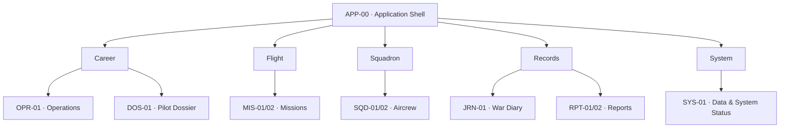

# UI V2 reference

Status: Approved repository design reference; published Site conformance verified

Date: 2026-08-31

Tracks: Issue #79

## Authority and boundary

UI V2 is the current design reference for WoFF Mate's future Windows desktop
companion. The published
[WoFF Mate UI V2 Site](https://woff-mate-ui-v2.pilotohans.chatgpt.site/) is the
active rendered source and replaces Figma for current visual review. The
existing
[Figma file](https://www.figma.com/design/Lc6VXJdI6L6w17bY4EjBvb/WoFF-Mate-UI-Prototype?node-id=0-1)
is retained only as the design origin and V1 archive.

This document, the [visual system](ui-v2-visual-system.md), and the recorded
[walkthrough](ui-v2-walkthrough.md) are the normative repository handoff for
V2. They describe design intent only. They do not prove a production UI, accept
the proposed toolkit ADR, or authorize a GUI dependency, SQLite access, direct
WoFF-file reads, writes, launcher control, or live-session behavior.

The published Site is subordinate to these toolkit-independent contracts. Its
passing conformance evidence is recorded in the
[published-site audit](ui-v2-rendered-audit.md); a visible prototype difference
cannot silently rewrite identity, accessibility, privacy, or navigation
requirements.

The architectural boundary in [Read-only UI foundation](read-only-foundation.md)
continues to apply.

## Product model

V2 is centered on one active **pilot career**, not on a display name. The shell
keeps that career in context while the user moves from an overview to records
and technical status.

The design follows seven rules:

1. Selection and navigation use a stable `career_id`; names are labels only.
2. Every current destination is read-only.
3. Historical atmosphere supports rather than competes with legibility.
4. The UI never invents identity, status, service, nationality, dates, or zero.
5. Overview precedes detail, with a clear route back to the originating view.
6. Components display already-interpreted values and contain no domain rules.
7. `PilotN` is a persistent simulator slot label, never the historical career
   identity or the selected option's position.

## Navigation architecture

The visible primary navigation order is fixed:

1. Operations
2. Pilot Dossier
3. Missions
4. Squadron
5. War Diary
6. Reports

`Data & System Status` is separated at the navigation footer. `Career Selector`
is opened from the context bar and is not another primary destination.

## Application shell

`APP-00` persists across the V2 flow:

| Region | Responsibility |
|---|---|
| Navigation rail | Shows the six primary destinations in the approved order, with icon and text. |
| Context bar | Shows the active career, opens `SEL-01`, and exposes a compact data-coverage summary. |
| Page header | Gives the current screen title, a short purpose statement, and read-only contextual links. |
| Content region | Holds one screen without duplicating global navigation. |
| System entry | Opens `SYS-01` from the navigation footer and stays visually separate from historical content. |

The reference desktop frame is 1440 by 1024 logical pixels, with a 256-pixel
navigation rail, 32-pixel page margins, a base 8-pixel grid, and 24-pixel major
gaps. Scaling adaptations are defined in the visual-system document.

## Screen inventory

### Core and global screens

| ID | Screen | Purpose | Primary entry | Expected exit |
|---|---|---|---|---|
| `APP-00` | Application Shell | Preserve career and navigation context around every view. | Application start or return from an unavailable state. | Any enabled primary destination, `SYS-01`, or `SEL-01`; `SYS-01` remains available when no career is selected. |
| `SEL-01` | Career Selector | Select one stable career and disambiguate same-name careers. | Context-bar career control or no-career state. | The last safe view for the selected `career_id`, normally `OPR-01`. |
| `OPR-01` | Operations | Summarize the active career, latest mission, warnings, and next read-only routes. | Default selected-career destination or primary navigation. | `DOS-01`, `MIS-02`, `JRN-01`, `SQD-01`, or `SYS-01`. |
| `DOS-01` | Pilot Dossier | Present the central identity, status, statistics, and record coverage for one career. | Primary navigation, Operations, or career selection. | `DOS-02`, `DOS-03`, `DOS-04`, `MIS-02`, or the previous primary view. |
| `MIS-01` | Mission Log | Present chronologically ordered mission summaries for the active career. | Primary navigation or Operations. | `MIS-02` or the previous primary view. |
| `SQD-01` | Squadron | Present the current roster and safe squadron context. | Primary navigation or Operations. | `SQD-02` or the previous primary view. |
| `JRN-01` | War Diary | Present the narrative timeline associated with stable mission identities. | Primary navigation, Operations, or Mission Report. | A related `MIS-02` or the previous primary view. |
| `RPT-01` | Reports | Present the available report library for the active career. | Primary navigation or Operations. | `RPT-02` or the previous primary view. |
| `SYS-01` | Data & System Status | Explain configuration, source coverage, freshness, and sanitized failures. | Persistent system entry or any data-status link. | The originating view or another primary destination. |

### Contextual screens

| ID | Screen | Purpose | Primary entry | Expected exit |
|---|---|---|---|---|
| `DOS-02` | Career Record | Show confirmed rank, squadron, injury, recovery, award, and status events. | Pilot Dossier. | Pilot Dossier or a linked Mission Report. |
| `DOS-03` | Victories & Claims | Keep claims distinct from confirmed victories and show confirmation state. | Pilot Dossier or Mission Report. | Pilot Dossier or the originating Mission Report. |
| `DOS-04` | Decorations | Show confirmed decorations and optional safe citation data. | Pilot Dossier. | Pilot Dossier. |
| `MIS-02` | Mission Report | Show one mission from an immutable, stable mission identity. | Mission Log, Operations, Dossier, or War Diary. | Mission Log, related War Diary entry, or Victories & Claims. |
| `SQD-02` | Aircrew Profile | Show a read-only squadron member profile without creating a career selection. | Squadron roster. | Squadron roster. |
| `RPT-02` | Report Viewer | Read one available report and explain unavailable content honestly. | Reports. | Reports. |

No core or contextual view has create, edit, delete, save, import, regenerate,
repair, browse, reset, launcher, or synchronization controls.

## Career selection contract

Each `SEL-01` option presents only safe display data:

- rank and name;
- normalized service or nationality when known;
- squadron when known;
- career state when known; and
- a short stable reference only when needed to distinguish homonyms.

The selected value is always `career_id`. Two careers with the same display
name remain separate options. The presentation does not group records by name,
derive identity from a slot or local path, or expose a campaign root. When no
career is selected, the shell preserves orientation and offers only `Select
career` and `View data status`.

`PilotN` remains a presentation-safe reference to the current WoFF source slot.
Slots may be sparse: if `Pilot1` is deleted, `Pilot2` remains `Pilot2` and is
never renumbered because it becomes the first visible row. Reusing `Pilot1`
later creates a different career with a new `career_id`; it does not revive or
inherit the deleted career. The selector may show `WoFF Pilot 2`, but list
position and slot label never replace `career_id` as the selection value.

## Pilot Dossier reference

`DOS-01` is the reference screen for the V2 hierarchy. It answers, in order:

1. Which career is in view?
2. What status is authoritatively recorded?
3. Which statistics are known?
4. What happened recently?
5. Which data is absent, partial, or unavailable?

### Layout order

| Order | Region | Content |
|---:|---|---|
| 1 | Context bar | Active career and compact data coverage. |
| 2 | Identity hero | Portrait, rank, name, service/nationality, squadron, career status, and record coverage. |
| 3 | Statistics strip | Missions, Flight Time, Claims, Confirmed Victories, Skill, and Reputation. |
| 4 | Main column | Latest Mission and up to five recent confirmed service events. |
| 5 | Side column | Recent victories and decorations, each linking to its complete contextual view. |
| 6 | Provenance summary | Friendly coverage and update text without paths, SQL, or raw source content. |

At wide widths the main and side columns use an approximate two-thirds to
one-third split. At high scaling or reduced width, the side column moves below
the main column without changing reading order.

### Data presentation

| UI label | Concept | Rule |
|---|---|---|
| Missions | `missions` | Show an authoritative integer, including `0`; never substitute zero for invalid input. |
| Flight Time | `flminutes` | Format for display as `H h MM min` without changing the source value. |
| Claims | `claims_count` | Never label or total claims as confirmed victories. |
| Confirmed Victories | `confirmed_victories` | Show only the supplied confirmed count. |
| Skill | `skill` | Show the supplied value without inventing a percentage, tier, or description. |
| Reputation | `reputation` | Show the supplied value without an inferred progress range. |

RFC, RNAS, and RAF remain distinct labels. Status rendering is lossless across
the normalized pilot-status contract:

| Authoritative normalized value | UI label |
|---|---|
| `Active` | Active |
| `KIA` | Killed in Action (KIA) |
| `PoW` | Prisoner of War (PoW) |
| `MIA` | Missing in Action (MIA) |
| `Invalided Out` | Invalided Out |
| `Survived War` | Survived War |
| `Lightly Wounded` | Lightly Wounded |
| `Seriously Wounded` | Seriously Wounded |
| Missing or unavailable | Unknown |

Missing status does not become `Active`; it renders as `Unknown`. The UI must
not collapse `PoW`, `MIA`, `Invalided Out`, `Survived War`, `Lightly Wounded`,
or `Seriously Wounded` into a generic `Wounded` or `Unknown` state. If the
presentation contract later receives a new authoritative non-empty normalized
value, it displays that value verbatim with an unsupported-mapping notice until
the label map is extended; it does not silently replace the value with
`Unknown`.

### Portrait contract

- Use a vertical 4:5 portrait, preferably an 800 by 1000-pixel master asset.
- Use monochrome or restrained sepia photography with a quiet background.
- Keep the crop consistent and place no name, rank, or other text in the image.
- Never invent a uniform, service, nationality, squadron, insignia, medal, or
  injury that is not supported by presentation-safe data.
- Use a neutral aviator silhouette when no portrait is available.
- Use alt text `Portrait of <display name>` or `Portrait unavailable`.
- Treat generated or illustrative portraits as synthetic demonstration assets,
  never as WoFF data or a real person's likeness.

## Data-honesty vocabulary

| Term | Meaning | Presentation |
|---|---|---|
| Authoritative zero | A trusted value equals zero. | Show `0` with the ordinary value style. |
| Unknown | The field exists conceptually but its value is not known. | Show an em dash plus `Unknown` in accessible text. |
| Not available | The current source or contract does not provide the field. | Show `Not available` and an optional safe reason. |
| None recorded | A collection was read successfully and is validly empty. | Use a collection-specific empty message. |
| Partial record | Identity is valid but optional fields or sources are missing. | Keep known data and show a persistent partial-record notice. |
| Missing | Required identity or source was not established. | Explain what is missing without guessing. |
| Truncated | Input was identified but failed completeness validation. | Show no unvalidated payload and link to System Status. |
| Unsupported | The format is recognized as outside the supported contract. | State that it is unsupported; do not imply corruption. |
| Unreadable | The source could not be safely read. | Show a sanitized message with no path or raw exception. |
| Error | The approved query failed. | Preserve safe context and expose `Retry view` plus `View data status`. |

These terms are design vocabulary for Issue #79. Issue #80 owns their formal
fixture matrix and deterministic fixture payloads.

## Published Site organization

The Site's Desktop Fixture Matrix exposes all 15 rendered screen IDs:

- `APP-00`, `SEL-01`, `OPR-01`, `DOS-01`, `DOS-02`, `DOS-03`, `DOS-04`,
  `MIS-01`, `MIS-02`, `SQD-01`, `SQD-02`, `JRN-01`, `RPT-01`, `RPT-02`, and
  `SYS-01`;
- fourteen semantic states from Complete through Not available; and
- Desktop profiles labelled 100%, 125%, 150%, and 200%.

The Career Selector remains reachable from the persistent context control and
also has a standalone `SEL-01` reference. The fixture matrix is a visual
coverage surface; Issue #80 still owns the formal deterministic fixture set.

## Archived Figma organization

The archived Figma file preserves this historical target organization:

| Page | Contents |
|---|---|
| `00 — Foundations` | Color, typography, spacing, icons, material, state, and accessibility references. |
| `01 — V2 Core Flow` | Shell, Career Selector, Operations, and the primary happy path. |
| `02 — Pilot Dossier` | Dossier, its state variants, contextual records, and portrait guidance. |
| `03 — Missions & Records` | Mission Log, Mission Report, War Diary, Reports, and Report Viewer. |
| `04 — Squadron` | Squadron roster and Aircrew Profile. |
| `05 — States & Fixtures` | Loading, empty, partial, missing, truncated, unsupported, unreadable, and error examples. |
| `06 — Components` | Reusable components and variants. |
| `90 — Future Gates` | Session Control and Headquarters, clearly unavailable in this phase. |
| `99 — Archive` | Preserved V1 frames, excluded from the current flow. |

Archived frames used `V2 / <screen-id> / <state> / <viewport>`, for example:

- `V2 / DOS-01 / Complete / Desktop`
- `V2 / DOS-01 / Partial / Desktop`
- `V2 / DOS-01 / No career / Desktop`
- `V2 / DOS-01 / Complete / 150% scale`

Figma is not current acceptance evidence and does not replace a rendered check
of the published Site.

## Required rendered coverage

The normative reference set covers:

- `APP-00`, `SEL-01`, `OPR-01`, `DOS-01`, `MIS-01`, `SQD-01`, `JRN-01`,
  `RPT-01`, and `SYS-01` for the shell and primary flow;
- `DOS-02`, `DOS-03`, `DOS-04`, `MIS-02`, `SQD-02`, and `RPT-02` for all
  contextual records;
- Dossier variants for complete, partial, no career, missing, truncated,
  unsupported, unreadable, query error, authoritative zeroes, unknown service
  and status, 150% scale, and keyboard focus order.

Every future rendered audit must pin the Site deployment identifier and archive
a new sanitized, hashed evidence set. Removing a primary or contextual screen
cannot make the audit pass; absence is a coverage failure unless this normative
inventory is explicitly revised and approved first.

## Future-gated modules

The following are not primary V2 destinations and must be visibly marked
future or unavailable if shown for planning:

- Preflight, Active Session, Postflight, and launcher controls;
- Headquarters, Mess, Quarters, Hangar, Memorial, and social systems;
- transfers, recovery, promotions, and correspondence as interactive modules;
- editable settings, assisted repair, import, or configuration discovery.

Each requires its own approved contract and gates. UI V2 does not approve
Product Gate A, B, or C and does not complete cycle 3.4.0.
